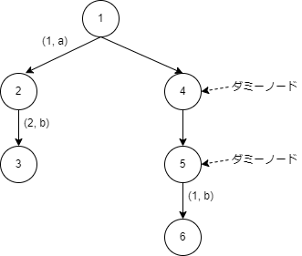
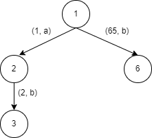

# 変更点

## dynamic_replacement関数
- 引数のvector<uint64_t> boxは、テストする際に使用(test_require_centroid_path_order_and_insert_dictionary)
    - 本番環境で実行する際には、このファイル内で使用しているboxはすべて、コメントアウトします

## compute_node_connect_and_blanch_num関数
- vector<uint64_t> blanch_num_expect_zeroの消去
    - 元々は、ゼロ分岐以外の累積和を計算するために使用していた
    - 累積和自体は、別の関数内で求めています

## require_centroid_path_order_and_insert_dictionary関数
- 変数の多くは、構造体にまとめました

- map<> start_posについて
    - compute_node...関数を使用して、vector<> childrenは計算されていると想定
    - その際、図1のようなDynPDTは、図2のようなDynPDTとして格納しているので、children内の値は以下のようになっていて、lambda_(=32)を超える値が多々、存在しています
        - 図2のようにしている理由は、累積和などを求める際に、ダミーノードの個数をカウントしないようにするためです
    - そのため、今回は、vector<> start_pos(lambda_)のような形ではなく、map関数を使用しています

|  |  |
| :---: | :---: |
| 図1 | 図2 |

- それ以降の処理について(match_per_leaf_numのソートなど)
    - これまでは、後方累積和を使用していなかったため、そもそも処理が間違っていました。
- この関数は、新しい関数と比較するために残してあるだけなので、今後は使用しないです

## require_centroid_path_order_and_insert_dictionary_using_backward_cumulative関数
- require_centroid_path_order_and_insert_dictionary関数に対し、後方累積和を追加した関数
- 処理する順番をfront(queue)とback(stack)に保存することによって実現しています
- front(queue)は、FIFOであることから、保存しておく必要がなく、求まった順に新しい辞書に追加するので、消す予定です

## HL分解について
- なんとなくの理解はできました
- しかし、どの部分に使用するのかが思いついていないです
- 現在は、新しい辞書に追加する際に、使用できるのではないかと考えている段階です

## 実行方法(それぞれのmapの挙動を確認する)
> git clone https://github.com/kawanishik/dynpdt_expansion.git  
> cd dynpdt_expansion  
> mkdir build && cd build  
> cmake ..  
> cd sample  
> make  
> ./sample ['マップ名']  

## 関数のテストを実行する際
> cd dynpdt_expansion  
> cd include/dynamic_replacement  
> mkdir build && cd build  
> cmake ..  
> make  
> ./test_compute_node_connect_and_blanch_num  
> ./test_require_centroid_path_order_and_insert_dictionary  
> ./test_require_centroid_path_order_and_insert_dictionary_using_backward_cumulative